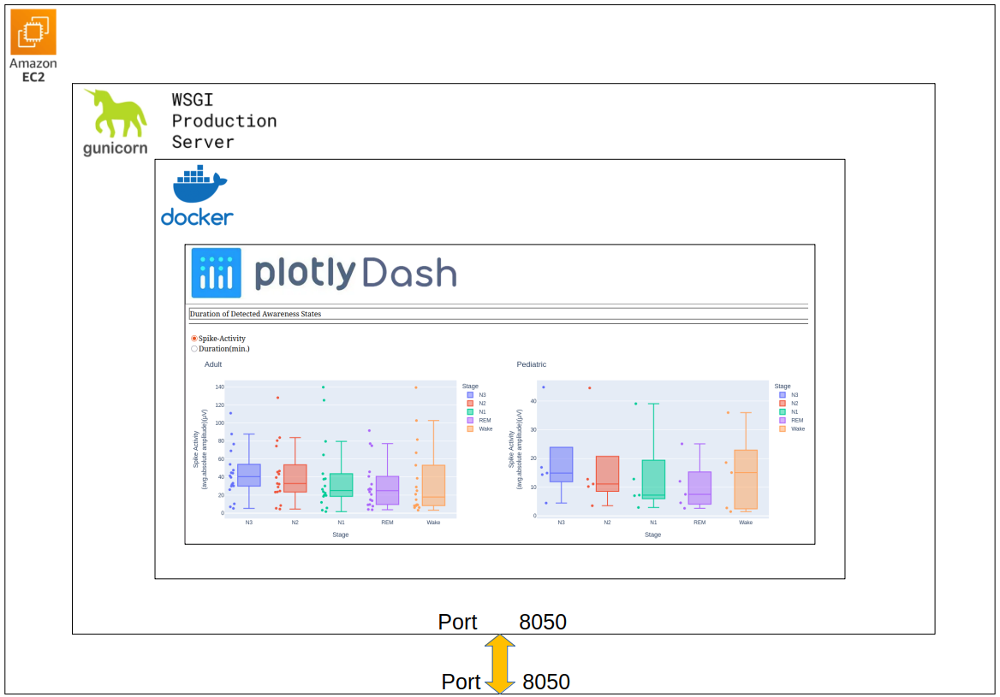

# Plotly Dashboards

This repository contains a Plotly Dash application for visualizing spike occurrence rates from anonymized patient CSV data. It is designed to run on an EC2 instance for scalable deployment.

[
  
](http://18.216.171.133:8050/)

[Dashboard Link](http://18.216.171.133:8050/)


## Features
- Interactive dashboards built with Plotly Dash
- Loads anonymized patient spike occurrence data from CSV files
- Dockerized for easy deployment
- Ready for cloud deployment (AWS EC2)

## Project Structure

- `src/` — Main application code
  - `persyst_dashboard.py` — Dash app entry point
  - `load_data.py` — Data loading utilities
- `Stage_Spike_Occurrence_Rate/` — Anonymized Patient CSV data files
- `Dockerfile` — Containerization setup
- `pyproject.toml` — Python dependencies
- `uv.lock` — Dependency lock file

## Usage
### 1. Build the Docker image using the provided Dockerfile:
```bash
    docker build --no-cache -t persyst-dashboards:v1 .
```

### 2. Run the docker container directly (only for development because it used the non-secure Dash server), use:
```bash
    docker run -it --rm -p 8050:8050 persyst-dashboards:v1
```

### 3. Alternatively, run the dashboard using Gunicorn for production:
```bash
    gunicorn src.persyst_dashboard:server --bind 0.0.0.0:8050
```


## Other Docker Commands
- List running Docker containers:
```bash
    docker ps
```

- List all Docker containers (including stopped):
```bash
    docker ps -a
```

- Stop a running Docker container:
```bash
    docker stop <container_id>
```

- Remove all unused resources including volumes:
```bash
    docker system prune -a --volumes
```

## Running on AWS EC2
1. Launch an EC2 instance with Docker installed.
2. SSH into the instance.
3. Clone this repository:
```bash
    git clone https://github.com/Daniel-Lachner-Piza/plotly-dashboards.git
```
4. Navigate to the project directory:
```bash
    cd <project-directory>
```
5. Build the Docker image:
```bash
    docker build --no-cache -t persyst-dashboards:v1 .
```
6. Kill Process Running on Port 8050:
```bash
    sudo lsof -i :8050
    sudo kill -9 <PID>
```
7. Run the Docker container:
```bash
    gunicorn src.persyst_dashboard:server --bind 0.0.0.0:8050
```
8. Access the dashboard in your web browser at `http://<ec2-public-ip>:8050/`.
