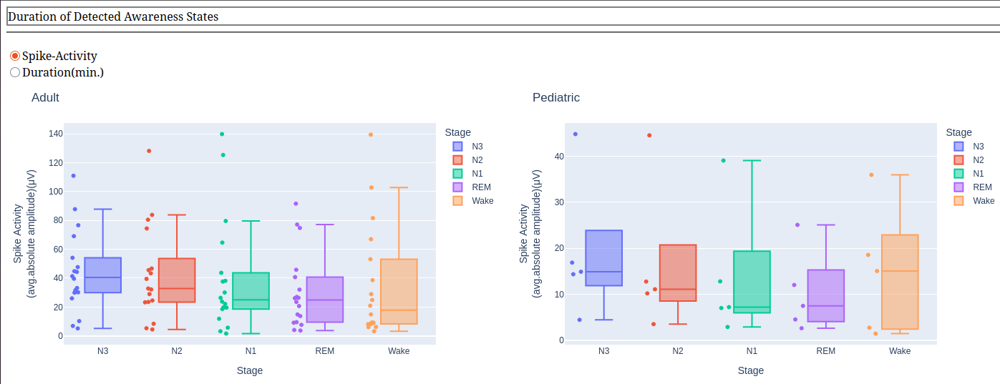

# Plotly Dashboards

This repository contains a Plotly Dash application for visualizing spike occurrence rates from anonymized patient CSV data. It is designed to run on an EC2 instance for scalable deployment.

[Dashboard Link](http://18.216.171.133:8050/)

## Features
- Interactive dashboards built with Plotly Dash
- Loads anonymized patient spike occurrence data from CSV files
- Dockerized for easy deployment
- Ready for cloud deployment (AWS EC2)

## Project Structure

- `src/` — Main application code
  - `persyst_dashboard.py` — Dash app entry point
  - `load_data.py` — Data loading utilities
- `Stage_Spike_Occurrence_Rate/` — Anonymized Patient CSV data files
- `Dockerfile` — Containerization setup
- `pyproject.toml` — Python dependencies
- `uv.lock` — Dependency lock file
